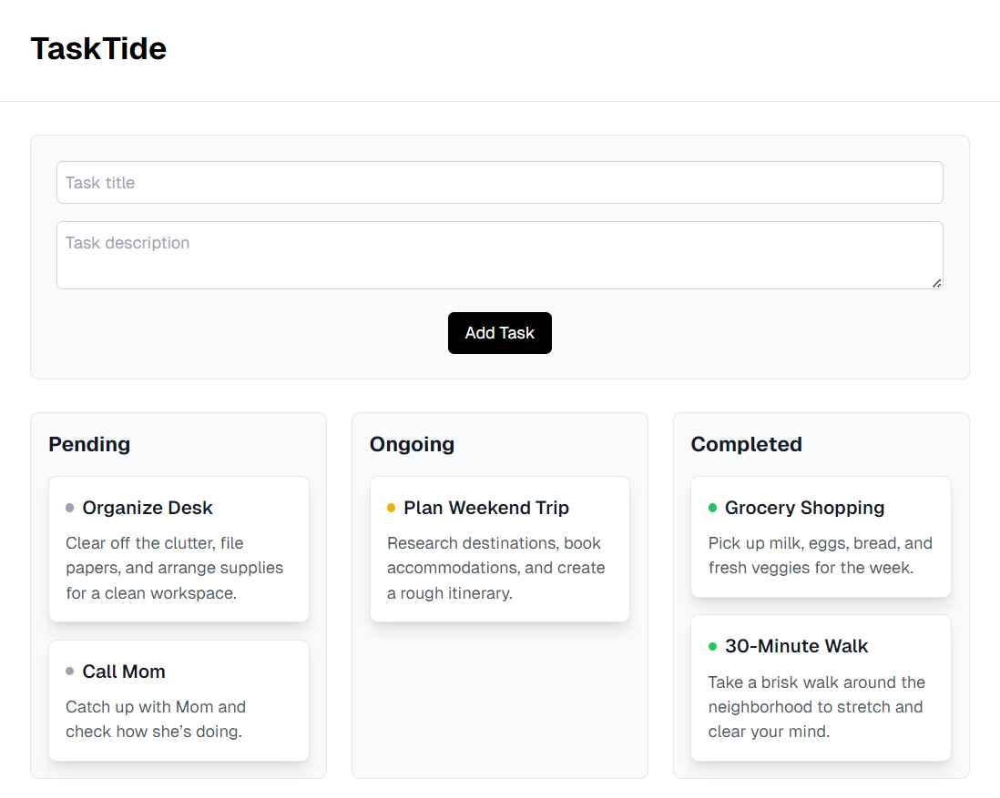

# TaskTide

TaskTide is a modern, intuitive task management application built with Next.js and TypeScript. It provides a Kanban-style interface for organizing and tracking tasks through different stages of completion.



## Features

### Current Features

- **Kanban Board Layout**: Organize tasks in three columns - Pending, Ongoing, and Completed
- **Drag and Drop**: Easily move tasks between different status columns
- **Visual Status Indicators**: Color-coded indicators show task status at a glance
- **Task Management**:
  - Create new tasks with title and description
  - Delete tasks when completed or no longer needed
- **Responsive Design**: Works seamlessly on both desktop and mobile devices
- **Real-time Updates**: Instant visual feedback for all task operations
- **Toast Notifications**: User-friendly notifications for task creation, movement, and deletion

## Technology Stack

- **Frontend Framework**: Next.js
- **Language**: TypeScript
- **Styling**: Tailwind CSS
- **Drag and Drop**: @hello-pangea/dnd
- **UI Components**: Custom components with modern design
- **Notifications**: Sonner toast notifications

## Getting Started

1. Clone the repository
2. Install dependencies:
   ```bash
   npm install
   ```
3. Run the development server:
   ```bash
   npm run dev
   ```
4. Open [http://localhost:3000](http://localhost:3000) in your browser

## Usage

1. **Creating a Task**:

   - Fill in the task title and description in the form at the top
   - Click "Add Task" to create a new task in the Pending column

2. **Moving Tasks**:

   - Drag and drop tasks between columns to update their status
   - Tasks can be moved from Pending → Ongoing → Completed

3. **Deleting Tasks**:

   - Hover over a task card to reveal the delete button
   - Click the X icon to remove the task

## Future Development

The following features are planned for future releases:

1. **Edit Task Feature**

   - Allow users to modify task titles and descriptions
   - Enable status updates through an edit modal

2. **Task Groups Feature**

   - Implement project or category-based task grouping
   - Add filtering and sorting by groups

3. **Time and Date Features**

   - Add due dates to tasks
   - Implement task scheduling
   - Add reminders and notifications for upcoming deadlines

   ***

   **Last Updated:** 20-02-2025 ⸻ **Last Reviewed:** 26-02-2025
